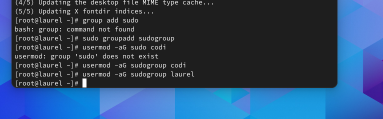
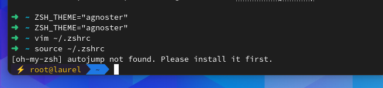

 

## 1.Arch Linux Website

Download an image and pick an ISO file listed under US. 

You will need to verify the signature. Listed on the website is the SHA265 hash.

If you use 7-zip you can see a files hash 

## 2. Open ISO file on the VM 

Following the instruction and make sure to give the the VM Hard Disk 20GB and the memory 2GB

Before you go into the VM. Go to the ARCH-LINUX.vmx file and add on the second line
firmware = "efi"
## 2. Make nessacary  checks 
### Verifying boot mode:
```shell
cat /sys/firmware/efi/fw_platform_size to check the boot mode and it was verified to be in  64-bit x64 UEFI
```


### check internet connection:
First use:
```shell
 ip link
```
Make sure status state is UP 

Then ping a website:
```shell
 ping archlinux.org
```


### Updating system clock:
```shell
 timedatect1
```


## Partition the disks
You will need to partition the disks

During this part I found out that sometimes the the ISO will not install correctly and you may need to reinstall if it's missing anything

To identify the block devices use lsblk or fdisk:
```shell
lsblk -f 
fdisk -1 
```


I partitioned  sda1 and sda2 in /dev/sda
* fdisk /dev/sda1
* fdisk /dev/sda2

I used g to create a new empty GPT partition table:
```shell
g = creates a new partition table 
n = adds a new parition 
p = will make the partition primary 
w = write new changes 
```
For the last sector of the first partition add +500M


Formatting the partition 

```shell
# For FAT
mkfs.fat -F 32 /dev/sda1
# For Ext4
mkfs.ext4 /dev/sda2
```

## 5.Mount the file system
```shell
# For the Fat file system:
mount --mkdir /dev/sda1 /mnt/boot
# For ext4 file system:
Mount /dev/sda2 /mnt
```

## 6. Installing a Disk and setup
```shell
pacstrap -K /mnt base linux linux-firmware networkmanager vim man-db man-pages texinfo
```


## 7. Fstab
```shell
genfstab -U /mnt >> /mnt/etc/fstab
```


## 8. Chroot
You will want to chroot into your new file system:
```shell
arch-chroot /mnt
```


### Once you have done that you will want to...

1. Set the time zone 
```shell
ln -sf /usr/share/zoneinfo/North_America/Oklahoma/Tulsa /etc/localtime|
hwclock --systohc
```

2. Localization
```shell
vim /etc/locale.gen
```
Uncomment en_US.UTF-8 UTF-8 

 ```shell
echo 'LANG=en_US.UTF-8' > /etc/locale.conf
```
3. Do network configuration by making a hostname 
 ```shell
echo 'laurel' > /etc/hostname
```
5. Initramfs
Not required 
 ```shell
mkinitcpio -P
```

7. Root password
 ```shell
passwd
```
6. Boot loader 
 ```shell
pacman -Sy grub efibootmgr
grub-install --target=x86_64-efi --efi-directory=boot --bootloader-id=GRUB
grub-mkconfig -o /boot/grub/grub.cfg
```
3. Make sure you download software and packages such as networking and man-db.

EXIT using exit or ctrl d 

## REBOOT

# Post installation customization

## 1. Add desktop environment
I added gnome for my desktop environment because it is one of the most common desktop enviroments.
```shell
pacman -Syu
```

REBOOT

```shell
pacman -S gnome 
systemctl start gdm.service 
systemctl enable gdm.service
pacman -S firefox vlc leafpad
```

REBOOT


## 2. Add users
Create users:
```shell
useradd -m codi
useradd -m laurel
```
Change the passwords to GraceHopper1906:
```shell
passwd codi 
passwd laurel 
```

```shell
pacman -S sudo vi 
#Uncomment  %sudo ALL=(ALL) ALL   
```

Create a group to hold sudo users:
```shell
group add sudogroup
usermod -aG sudogroup laurel 
usermod -aG sudogroup codi 
```



## 3. SSH
To add ssh 
```shell
pacman -Sy openssh 
```

## 4. MISC Customization 
```shell
pacman -Sy firefox
```


## 5.Customize the terminal 
I had trouble figuring this one out 
Changing Bash to zsh
```shell
pacman -S zsh
```
```shell
chsh -s /bin/zsh
```
### Customizing zsh 
```shell
sh -c "$(curl -fsSL https://raw.github.com/ohmyzsh/ohmyzsh/master/tools/install.sh)"
```

Vim into ~/.zshrc and change...
```shell
ZSH_THEME="agnoster"
```
```shell
PROMPT='%n@%m %~ %# '
```
Add alias
```shell
alias ll='ls -alF'
```
```shell
alias ls='ls --color=auto'
```

To apply changes:
```shell
source ~/.zshrc
```
Then leave terminal and go back in to see changes 



